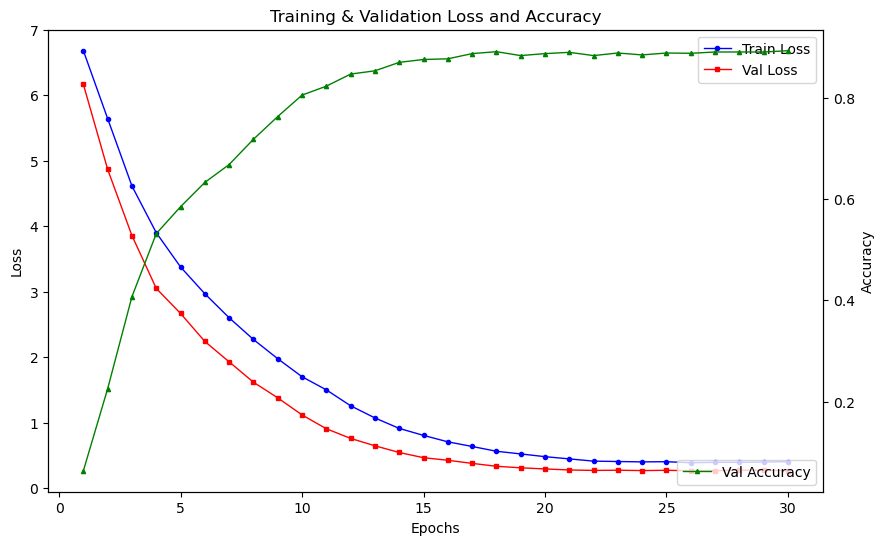

# Buffalo Re-Identification

## Overview
This project implements a **Buffalo Re-Identification** model using **Transfer Learning**. The base model used is **EfficientNet-B3**, which has been fine-tuned for buffalo classification. After training, the final classification layer is frozen, and the model is used for **feature extraction** from buffalo images.

## Dataset
The dataset used in this project is a combination of three different sources, totaling approximately **10,000** images:

- **[Dataset 1 - Kaggle](#)**
- **[Dataset 2 - Zenodo](#)**
- **[Dataset 3 - Custom Collected Data](#)**

To ensure balance, **data augmentation** techniques were applied for proper distribution across **training, validation, and testing** sets.

## Methodology
1. **Base Model Selection**: EfficientNet-B3 was chosen as the backbone for transfer learning.
2. **Fine-Tuning**: The model was trained on buffalo classification using the prepared dataset.
3. **Feature Extraction**: After training, the final classification layer was frozen, and the model was used to extract deep features from buffalo images.
4. **Dataset Balancing**: Augmentation techniques like **rotation, flipping, and scaling** were applied to balance the dataset.
5. **Training-Validation Split**: The dataset was divided into training, validation, and test sets to ensure proper model generalization.

## Performance Metrics
Below is the graph representing **Training Loss, Validation Loss, and Validation Accuracy** over the epochs:



## Installation & Usage
### Prerequisites
- Python 3.x
- PyTorch
- TensorFlow/Keras (if applicable)
- OpenCV
- NumPy & Pandas

### Steps to Run
1. Clone the repository:
   ```bash
   git clone https://github.com/your-repo/buffalo-reid.git
   cd buffalo-reid
   ```
2. Install dependencies:
   ```bash
   pip install -r requirements.txt
   ```
3. Run the training script:
   ```bash
   python train.py
   ```
4. Extract features from images:
   ```bash
   python extract_features.py --input image.jpg
   ```

## Future Work
- Implementing a real-time identification pipeline.
- Experimenting with different model architectures for improved accuracy.
- Deploying the model as an API for easier access.

## Author
**Nitesh Kumar**

---

For any questions, feel free to reach out!

